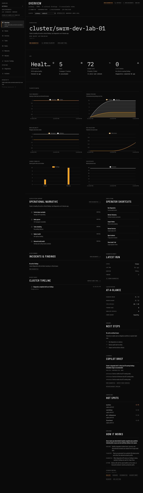
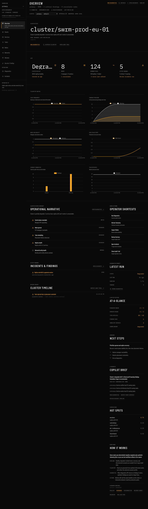
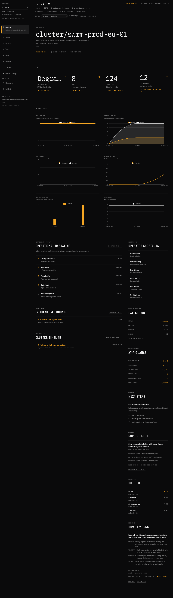
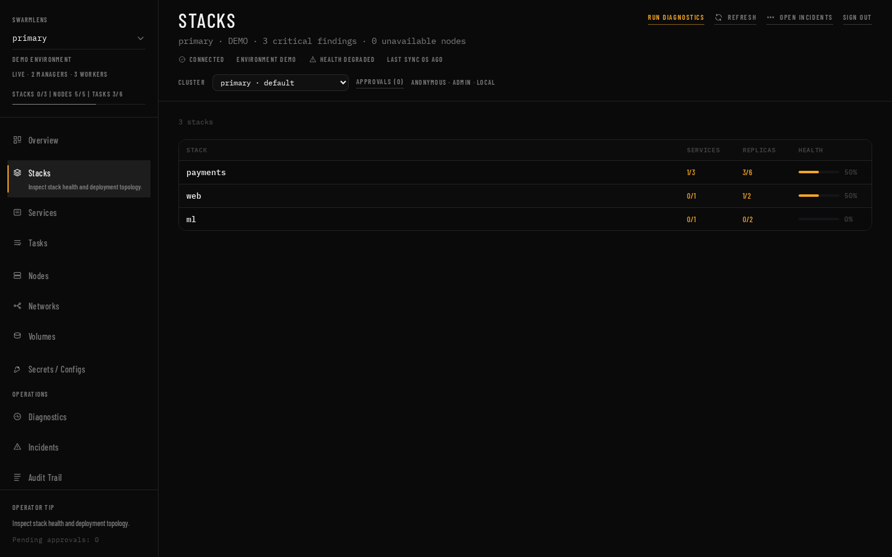
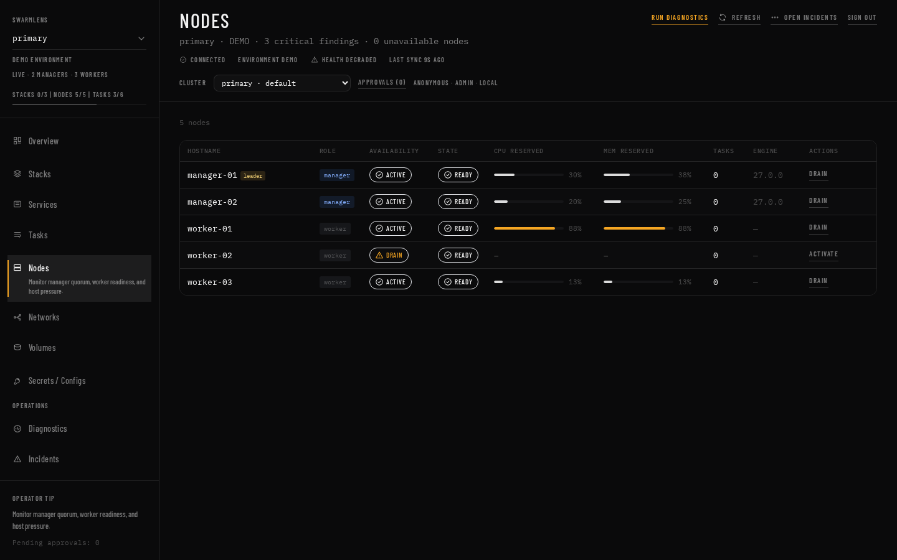
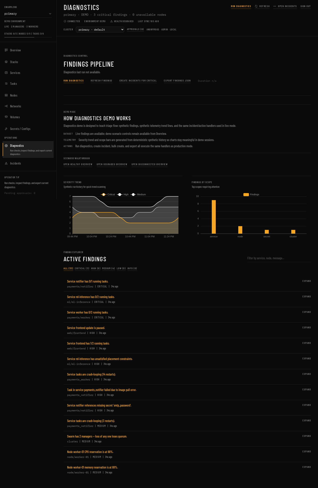
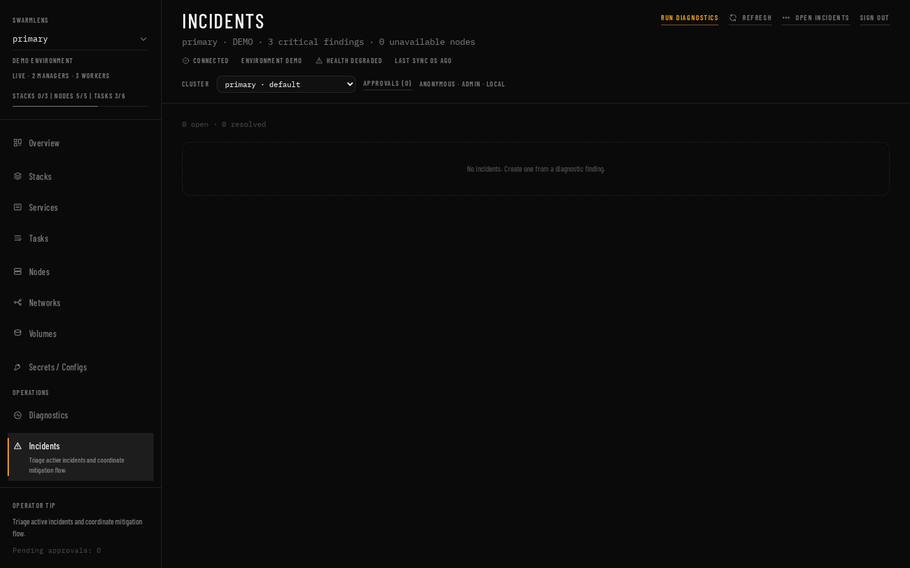
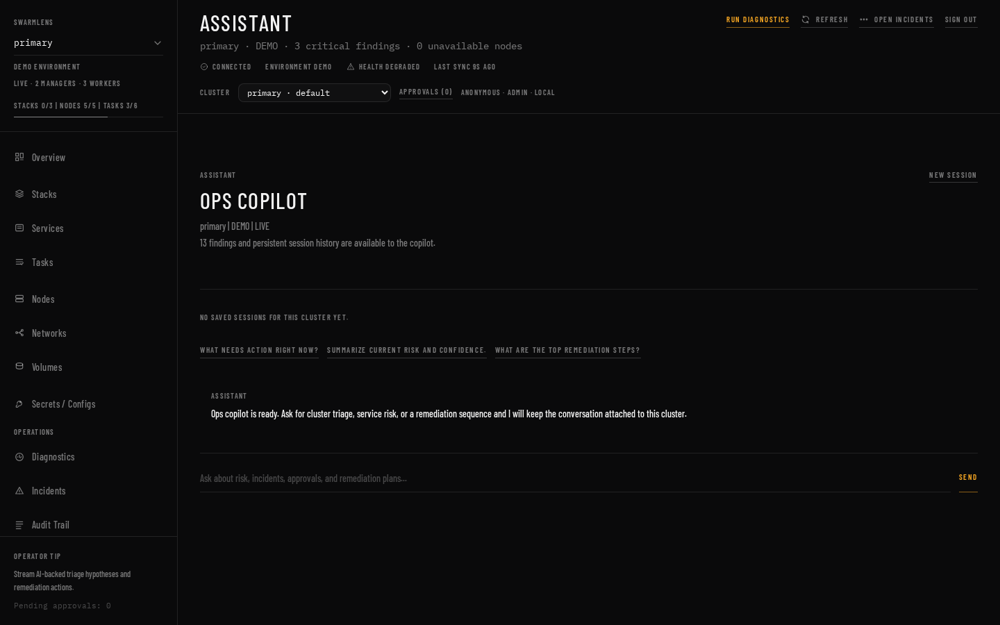

# SwarmLens Gallery

This gallery showcases the main views of the SwarmLens operations console.

## Overview Scenarios

### Healthy State

### Degraded State

### Incident Burst

## Resource Management

### Stacks

### Services

### Nodes

## Operations & Diagnostics

### Diagnostics Engine

### Incident Management

### Audit Log

### AI Assistant

